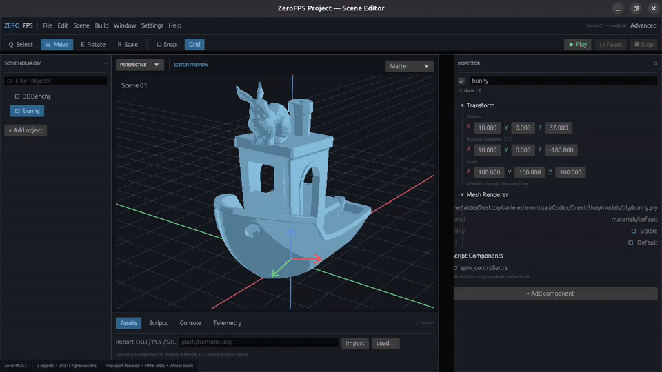
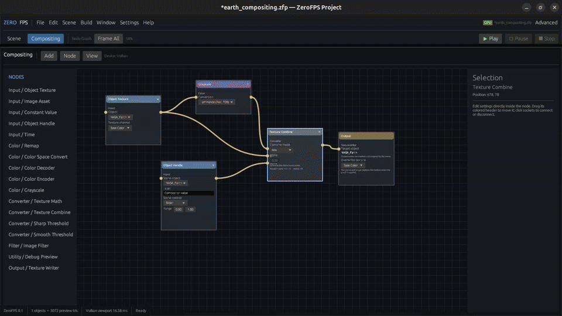

# ⚠️ ZeroFPS-Project ⚠️ (WARNING: Vibe Coded Project)
## Rendering at the speed of static images.

This project is born to create a game engine from scratch in Rust, but in the process has been created a nice static postcard simulator...



ZeroFPS now includes a Vulkan-powered viewport and node compositor. Texture graphs stay GPU-resident, execute asynchronously, preserve `RGBA32Float` values between nodes, and clamp only when connected to an object color output. The same graph contract has a deterministic CPU implementation and automatic fallback.



## Goals

- [x] Build a responsive Rust engine/editor with isolated input, rendering, import, and dialog work.
- [x] Provide a 3D scene editor backed by a shared hierarchical transform and cascading-attribute model.
- [x] Import GLB/glTF, OBJ, PLY, and STL, with reversible small-hole mesh repair.
- [x] Render textured meshes using depth buffering, diffuse/toon materials, smooth normals, and perspective/orthographic cameras.
- [x] Save portable `.zfp` projects containing readable scene settings and copied assets.
- [x] Author node-based texture graphs and apply color/channel operations to object textures.
- [x] Render the viewport through Vulkan with GPU-resident color and depth targets.
- [x] Evaluate complete compositor graphs on the GPU without intermediate CPU readback.
- [x] Preserve unbounded floating-point texture values between nodes and clamp at color-output boundaries.
- [x] Keep CPU and Vulkan compositor implementations in parity, with asynchronous workers and CPU fallback.
- [x] Validate the Vulkan renderer and compositor on NVIDIA RTX hardware.
- [ ] Complete compositor evaluation and add typed physical fields, normalization, units, and UV/object/world-space mapping.
- [ ] Simulate heat diffusion, thermal emission, IR reflection, and night-vision sensors.
- [ ] Support skeletal animation, ragdolls, and modular physics.
- [ ] Add replaceable cameras, lights, post-processing pipelines, and explicit GPU asset streaming.
- [ ] Create a concise Rust-based scripting language and compile scripts into games.
- [ ] Provide an in-app custom HUD creator.
- [ ] Compile, launch, and debug standalone native Rust games with editor telemetry.
- [ ] Make multiplayer native through concise authoritative server and scripting APIs.
- [ ] Stabilize replaceable subsystem contracts and document the complete game-creation workflow.

## Run

This Rust game engine rewritten from scratch can be compiled and run with:

```bash
cargo run -p zerofps-editor
```
